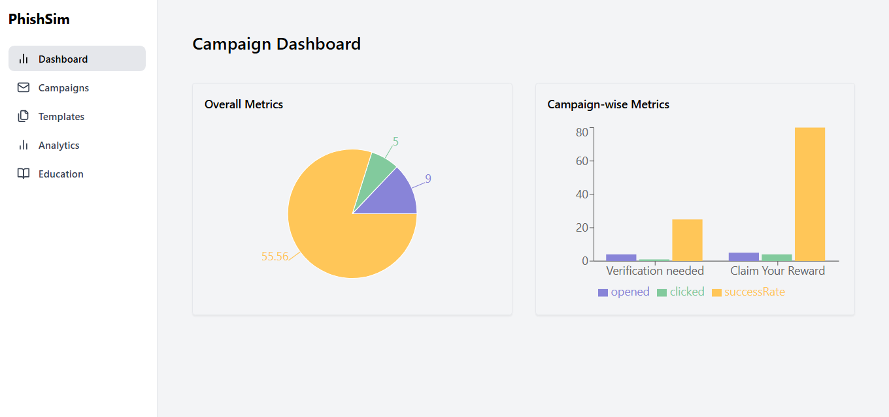
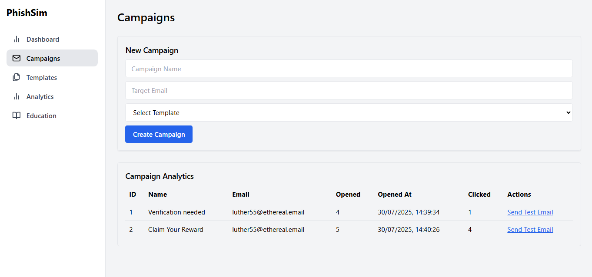
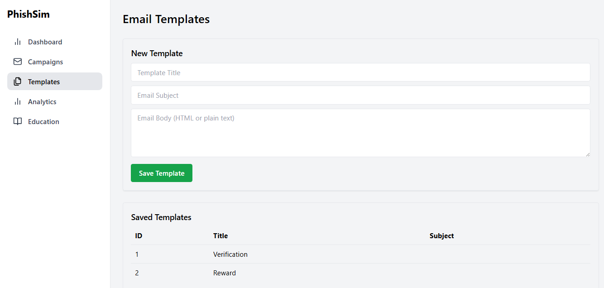
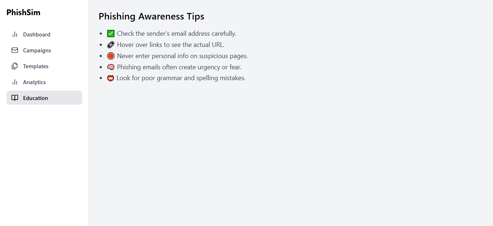

# 🛡️ PhishSim – Ethical Phishing Simulation Platform

**PhishSim** is a full-stack ethical phishing simulation platform designed to help organizations train and educate users about phishing attacks. It allows admins to send simulated phishing emails, track user interactions (opens, clicks), and educate users post-campaign.

---

## 🚀 Features

* Create and manage phishing campaigns
* Send tracked phishing emails
* Track email opens with pixel-based tracking
* Track link clicks and log timestamps
* Dashboard for campaign analytics
* Post-campaign educational feedback

---

## 🧰 Tech Stack

**Frontend:**

* React.js
* Tailwind CSS

**Backend:**

* Flask (Python)
* SQLite with SQLAlchemy ORM
* Flask-Mail for email sending
* CORS & JSON API support

---

## 🗂️ Project Structure

```
PhishSim/
├── assets/                   # Screenshots or static files
├── backend/
│   ├── app.py                # Main Flask app
│   ├── models.py             # SQLAlchemy models
│   ├── requirements.txt      # Python dependencies
│   ├── phishing.db           # SQLite database
│   └── __pycache__/
│
├── frontend/
│   ├── src/
│   │   ├── components/
│   │   │   └── Layout.tsx
│   │   ├── pages/
│   │   │   ├── Analytics.tsx
│   │   │   ├── Campaigns.tsx
│   │   │   ├── Dashboard.tsx
│   │   │   ├── Education.tsx
│   │   │   └── Templates.tsx
│   │   ├── App.tsx
│   │   ├── index.css
│   │   └── main.tsx
│   ├── index.html
│   ├── package.json
│   ├── package-lock.json
│   ├── tailwind.config.cjs
│   └── vite.config.ts
│
├── .gitignore
└── README.md
```

---

## ⚙️ How It Works

1. **Create Campaign** – Admin adds campaign name and target email addresses.
2. **Send Emails** – Emails include:

   * Tracked link: `/api/click/<id>`
   * Open tracker: `">`
3. **Track Actions**:

   * Email open triggers an `opened_at` timestamp.
   * Link click triggers a `clicked_at` timestamp.
4. **Educate Users** – After interacting, users are redirected to a learning page.

---

## 📸 Screenshots

### 📊 Dashboard Overview



---

### 📋 Campaigns Page



---

### 📨 Email Templates Section



---

### 🎓 Post-Campaign Education Page



---

## 📦 Installation & Setup

### 🔧 Backend Setup

```bash
cd backend
pip install -r requirements.txt
python app.py
```

### 💻 Frontend Setup

```bash
cd frontend
npm install
npm run dev
```

---

## 🔐 Intended Use

PhishSim is strictly for **ethical and educational** use:

* ✅ Corporate security awareness programs
* ✅ Cybersecurity training labs
* ✅ Penetration testing simulations

**⚠️ Never use this tool for malicious purposes.**

---

## 📊 Future Improvements

* Admin authentication system
* Campaign scheduling
* Email template editor (drag-and-drop)
* Role-based access control (RBAC)
* Export analytics to CSV

---

## 🧠 Learnings

PhishSim helped us understand:

* How phishing attacks exploit human behavior
* Methods to track and measure user awareness
* Best practices to educate and reduce risks

---

## 📜 License

This project is for **educational and ethical use only**. Unauthorized or malicious usage is strictly prohibited and may be illegal.

---
